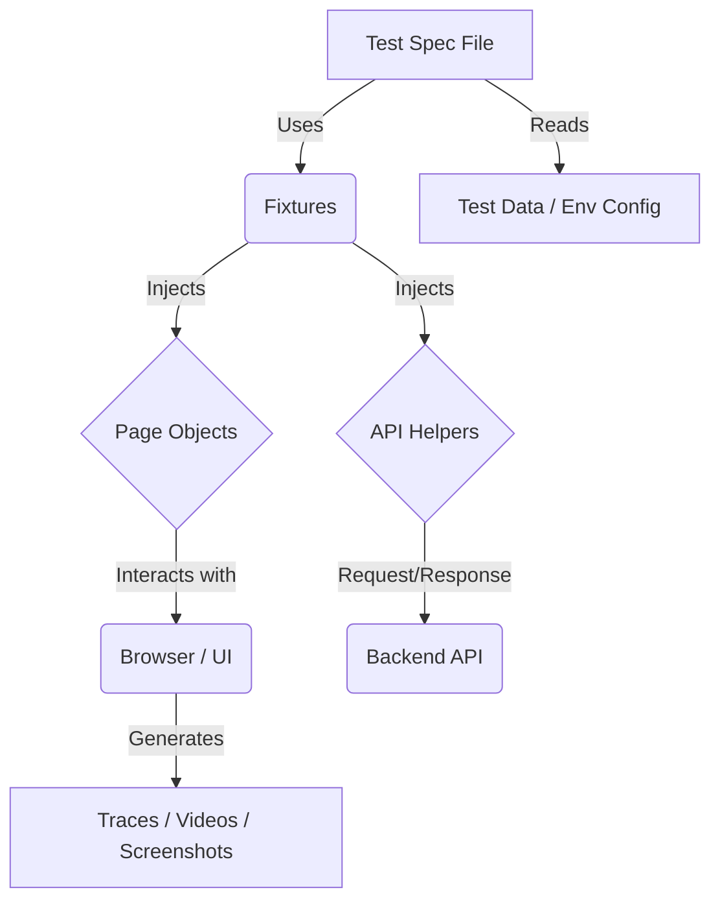

# Playwright Automation Framework - The Complete Guide

Welcome to the **OrangeHRM Automation Framework**. This documentation is designed to be a comprehensive "Master Class" on how this specific project is built, how it works, and how to extend it.

---

## 📚 Table of Contents
1. [Architecture Overview](#-architecture-overview)
2. [Project Structure Deep Dive](#-project-structure-deep-dive)
3. [Core Concepts](#-core-concepts)
   - [Page Object Model (POM)](#page-object-model-pom)
   - [Fixtures & Dependency Injection](#fixtures--dependency-injection)
   - [Configuration Deep Dive](#configuration-deep-dive)
4. [Test Scenario Walkthroughs](#-test-scenario-walkthroughs)
   - [UI Lifecycle Test](#ui-lifecycle-test-anatomy)
   - [Hybrid API Test](#hybrid-api-test-anatomy)
5. [Data & Environments](#-data--environments)
6. [Execution & Debugging](#-execution--debugging)
7. [Developer Guide: How to Add Tests](#-developer-guide-how-to-add-tests)
8. [Reporting & Artifacts](#-reporting--artifacts)
9. [Troubleshooting & Best Practices](#-troubleshooting--best-practices)
10. [CI/CD Pipeline](#-cicd-pipeline)

---

## 🏛 Architecture Overview

This framework is built on **Playwright** handling the browser automation, **TypeScript** for type safety, and **Node.js**.



**Key Philosophy:**
1.  **Isolation**: Tests don't know about DOM selectors, they just call methods like `login()`.
2.  **Stability**: We use "User-Facing" locators (Roles, Text) instead of CSS/XPaths (IDs, Classes) where possible.
3.  **Speed**: Parallel execution is enabled by default (though serial mode is used for dependent steps).

---

## 📂 Project Structure Deep Dive

| Path | Type | Purpose |
| :--- | :--- | :--- |
| **`playwright.config.ts`** | **Core** | The brain of the framework. Controls browsers, timeout, reporters, and multi-threading. |
| **`.env.qa`** / `.env.dev` | **Config** | Stores sensitive/dynamic info like URLs and Usernames for specific environments. |
| **`src/fixtures/pom-fixtures.ts`** | **Wiring** | **CRITICAL**. This file connects your Page Objects to your Tests. It handles "setup" and "teardown" of page objects automatically. |
| **`src/pages/`** | **Logic** | Contains the `BasePage` (parent) and feature pages (`LoginPage`, `PIMPage`). All selector logic lives here. |
| **`src/tests/ui/`** | **Tests** | End-to-end UI scenarios. |
| **`src/tests/api/`** | **Tests** | API-only or Hybrid scenarios. |
| **`src/utils/EnvManager.ts`** | **Helper** | A smart utility to decide which `.json` config file to load based on `TEST_ENV`. |
| **`src/utils/test-data.ts`** | **Data** | The central hub for data. It merges static strings (from `data.json`) with the current environment's credentials. |

---

## 🧠 Core Concepts

### Page Object Model (POM)
We do not write `await page.click('#btn')` in tests. We use **Classes**.

**Structure of a Page Object (`src/pages/PIMPage.ts`):**
1.  **Locators (Properties)**: Defined at the top.
    ```typescript
    private addButton = this.page.getByRole('button', { name: 'Add' });
    ```
2.  **Constructor**: Takes the Playwright `Page` and passes it up to `BasePage`.
3.  **Methods (Actions)**: Clear, descriptive names.
    ```typescript
    async addEmployee(firstName: string, ...) {
        await this.addButton.click(); // Uses the locator above
        // ...
    }
    ```

### Fixtures & Dependency Injection
This is the "magic" that lets you write `({ loginPage })` in your test.

**How we built it (`src/fixtures/pom-fixtures.ts`):**
1.  We **extend** the base Playwright test object.
2.  We define `loginPage`, `pimPage`, etc.
3.  We tell Playwright *how* to initialize them:
    ```typescript
    loginPage: async ({ page }, use) => {
        await use(new LoginPage(page)); // Create instance, pass it to test
    }
    ```
4.  Now, every test gets a fresh, isolated instance of the Page Object.

### Configuration Deep Dive (`playwright.config.ts`)
*   **`fullyParallel: true`**: Runs all tests at the same time (fast!). Use `test.describe.configure({ mode: 'serial' })` to disable.
*   **`retries`**: On CI, we retry failed tests 2 times.
*   **`workers`**: On CI, we limit workers to 2 to avoid resource crowding. Locally, it uses 100% of your CPU cores.

---

## 🔍 Test Scenario Walkthroughs

### UI Lifecycle Test Anatomy
**File**: `src/tests/ui/employee_lifecycle.spec.ts`

1.  **`test.describe.configure({ mode: 'serial' })`**:
    *   **Why?** This file creates an employee, then edits THAT employee, then deletes THAT employee. The steps must happen in order.
2.  **`test.beforeEach`**:
    *   Runs before every single `test()` block in this file. Logs the user in so we don't repeat that code.
3.  **Dynamic Data Generation**:
    *   `const employeeData = TestData.generateEmployee();` creates a unique ID (e.g., "User_9382") so tests never clash with existing data.

### Hybrid API Test Anatomy
**File**: `src/tests/api/employee_api.spec.ts`

This test is advanced. It listens to the **Network Traffic** of the browser.

1.  **Setting the Trap**:
    ```typescript
    const createPromise = page.waitForResponse(resp => resp.url().includes('/pim/employees') && resp.status() === 200);
    ```
2.  **Triggering the Action**: We click "Save" in the UI.
3.  **Catching the Result**:
    ```typescript
    const response = await createPromise;
    ```
    *   We now have the raw server response JSON. We verify the `employeeId` matches what we sent.

---

## 🌍 Data & Environments

| Environment | Config File | Trigger Command |
| :--- | :--- | :--- |
| **QA** | `src/testData/envConfig/qa.json` | `npm run test:qa` |
| **DEV** | `src/testData/envConfig/dev.json` | `npm run test:dev` |
| **STAGE** | `src/testData/envConfig/stage.json` | `npm run test:stage` |

**How to add a new environment:**
1.  Create `src/testData/envConfig/uat.json`.
2.  Update `src/utils/EnvManager.ts` to include case 'uat'.
3.  Add script `"test:uat": "cross-env TEST_ENV=uat playwright test"` in `package.json`.

---

## 🐞 Execution & Debugging

| Command | Usage |
|---|---|
| `npm run test` | Run all tests (Headless mode) - **CI Friendly** |
| `npm run test:ui` | **Interactive Mode**: Opens Playwright UI runner. Best for local development. |
| `npm run test:debug` | **Debugger**: Pauses execution at each step. |
| `npm run test:api` | Runs tests tagged with `@API`. |
| `npm run report` | Opens the HTML report from the last run. |

---

## 🚀 Developer Guide: How to Add Tests

Follow this workflow to add a new test scenario (e.g., "Delete a Candidate").

### Step 1: Create the Page Object
Create `src/pages/RecruitmentPage.ts`:
```typescript
import { BasePage } from './BasePage';
export class RecruitmentPage extends BasePage {
    private deleteButton = this.page.getByRole('button', { name: 'Delete' });
    
    async deleteCandidate() {
        await this.deleteButton.click();
    }
}
```

### Step 2: Register in Fixtures
Update `src/fixtures/pom-fixtures.ts`:
```typescript
import { RecruitmentPage } from '../pages/RecruitmentPage';
// ...
type OrangeHRMFixtures = {
    // ...
    recruitmentPage: RecruitmentPage;
}
// ...
recruitmentPage: async ({ page }, use) => {
    await use(new RecruitmentPage(page));
}
```

### Step 3: Write the Test
Create `src/tests/ui/recruitment.spec.ts`:
```typescript
import { test, expect } from '../../fixtures/pom-fixtures';

test('Delete Candidate', async ({ loginPage, recruitmentPage }) => {
    await loginPage.navigate();
    await loginPage.login(...);
    await recruitmentPage.deleteCandidate();
    // assertions...
});
```

---

## 📊 Reporting & Artifacts

When a test runs, we generate several artifacts.

### 1. HTML Report (`playwright-report/`)
The main dashboard. Run `npm run report` to view it.
- Shows pass/fail status.
- Shows hierarchy of nested steps.

### 2. Traces (`trace.zip`)
**Configured as**: `trace: 'on-first-retry'`
- If a test fails on retry, a Trace is saved.
- **How to view**: Upload the `.zip` to [trace.playwright.dev](https://trace.playwright.dev) or open it via the HTML report.
- **Content**: Snapshots of the DOM before/after every click, console logs, network requests.

### 3. Videos (`test-results/`)
**Configured as**: `video: 'retain-on-failure'`
- We only keep videos if the test **fails**, to save disk space.

### 4. Screenshots
**Configured as**: `screenshot: 'only-on-failure'`
- Automatically attached to the HTML report report upon failure.

---

## 🔧 Troubleshooting & Best Practices

### Common Errors

| Error | Cause | Solution |
| :--- | :--- | :--- |
| **`Target closed`** | Browser crashed or was closed manually. | Rerun. If on CI, check memory usage. |
| **`Timeout 30000ms exceeded`** | Element not found within 30s. | Check your selector. Is the element inside an iframe? Is it hidden? Try `test:ui` to debug. |
| **`Element is not stable`** | Element is animating. | Playwright auto-waits, but sometimes you need `await expect(loc).toBeVisible()` before clicking. |

### Selector Best Practices
❌ **Bad**: `page.locator('div > div:nth-child(3) > button')` (Brittle!)
✅ **Good**: `page.getByRole('button', { name: 'Save' })` (Resilient, Accessible)
✅ **Good**: `page.getByLabel('User Name')` (Great for form inputs)
✅ **Good**: `page.getByTestId('submit-btn')` (If devs add `data-testid` attributes)

---

## 🤖 CI/CD Pipeline

**File**: `.github/workflows/main.yml`

This pipeline is "Event Driven".

1.  **Events**:
    *   `push`: Code pushed to master.
    *   `workflow_dispatch`: User clicks "Run Workflow" button in GitHub Actions UI.
2.  **The Matrix**:
    *   The pipeline installs Node, installs Playwright, and then executes the tests.
3.  **Artifacts**:
    *   If a test fails, the `playwright-report` folder (containing the video and trace) is zipped and uploaded. You can download this zip from the GitHub Actions run summary to debug failures that happened in the cloud.
